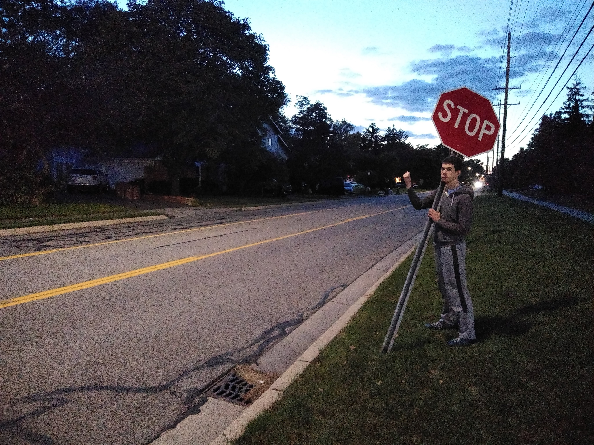

:::: {style="display: flex;"}

::: {}
```{r, echo=FALSE, out.width="100%"}

```
:::

::: {}
This is my home page. **Currently under construction**
:::

::::

```{r, echo=FALSE, out.width="100%"}

```