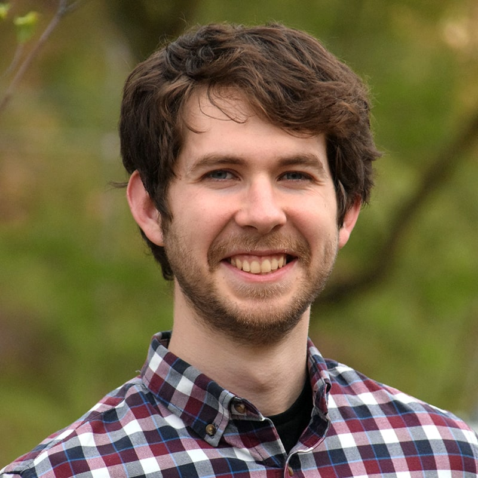

\vspace{1cm}

:::: {style="display: grid; grid-template-columns: 1fr 1fr; grid-column-gap: 10px; "}

::: {}

## James Carzon

I'm James, a PhD student in the _Department of Statistics and Data Science_ at **Carnegie Mellon University**.
At CMU, I am a member of the [_STAtistical Methods for the Physical Sciences_](https://www.cmu.edu/dietrich/statistics-datascience/stamps/) (STAMPS) Research Center.
I am fortunate to be advised by [Ann B. Lee](https://www.stat.cmu.edu/~annlee/).

I work on likelihood-free inference (LFI) methodology motivated by the physical sciences, including astrophysics, high energy physics, and environmental science. Many scientific problems can be posed as a task of recovering the hidden parameters of a forward-evaluable process (e.g., an observational experiment, a simulator). My research focuses on recovering parameters while providing guarantees needed for scientific inference to be both trustworthy **and** practical, often with the help of modern machine learning.

Before joining CMU, I obtained my BS in mathematics and BA in philosophy at the University of Michigan -- Dearborn.

:::

::: {}

{width=60%}
:::

::::

::::

## About this site

This website was created with reference to the useful on the [Crump Lab website](https://crumplab.com/LabJournalWebsite/index.html).
