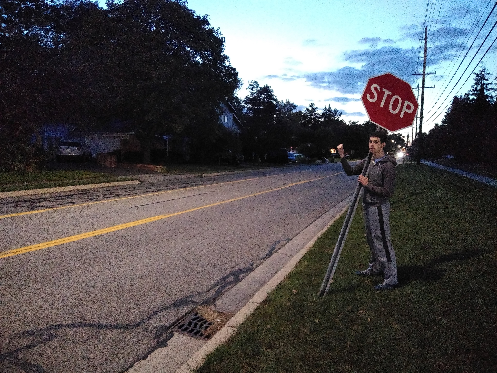

:::: {style="display: grid; grid-template-columns: 1fr 1fr; grid-column-gap: 10px; "}

https://jamescarzon.github.io/img/headshot.jpg

::: {}

:::

::: {}
# James Carzon

#### Doctoral student
#### Department of Statistics and Data Science
#### Carnegie Mellon University
:::

::::

## About me

I'm a first year doctoral student in the statistics Ph.D. program at Carnegie 
Mellon University. I'm interested in studying the history of statistics and the 
statistical methods used in physical and natural sciences.

:::: {style="display: grid; grid-template-columns: 1fr 1fr; grid-column-gap: 10px; "}

::: {}
This is an example of a non-academic thing that I do.
:::

::: {}
<iframe width="560" height="315" src="https://www.youtube.com/embed/pqOXnC_k8q0" title="YouTube video player" frameborder="0" allow="accelerometer; autoplay; clipboard-write; encrypted-media; gyroscope; picture-in-picture" allowfullscreen></iframe>
:::

::::

## About my website

Text here.

```{r, echo=FALSE, out.width="100%", out.height="60%", fig.cap="They told me to stop dealing threats to Uber drivers, but I don't have any other use for the stop sign I nicked from my old primary school.", }

```

## About my writing

Text here.